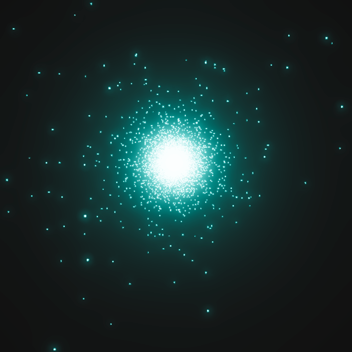

# najm.dot


<table style="border: none; border-collapse: collapse; width: 100%;">
  <tr>
    <!-- Text Cell -->
    <td style="border: none; padding: 0; margin: 0;" width="60%" valign="top">
      <h2>High-Performance N-Body Simulation</h2>
      This simulation leverages Unity's Data-Oriented Tech Stack (DOTS) and the Barnes-Hut algorithm to efficiently compute gravitational forces for tens of thousands of bodies in real-time.
      <br><br>
      <b>Features:</b>
      <ul>
        <b>High-Performance Barnes-Hut Algorithm</b>: Reduces complexity from O(n²) to O(n log n) using a morton-encoded octree built with a parallel radix sort.<br><br>
        <b>Data-Oriented Design</b>: Struct-Of-Arrays used for Processing to achieve High-Performance while also converting the SoA into AoS for easy editing.<br><br>
        <b>Physically Accurate Initial Conditions</b>: Generates stable Keplerian orbits from standard orbital elements (semimajor axis, eccentricity, inclination, etc.).<br><br>
        <b>Massively Parallel CPU Computation</b>: Fully multithreaded using Unity's Job System and Burst compiler for optimal performance.<br><br>
        <b>Custom Tooling</b>: An intuitive custom inspector for managing simulation parameters and body properties.<br><br>
      </ul>
    </td>
    <!-- GIF Cell -->
    <td style="border: none; padding: 0; margin: 0;" width="40%" valign="top" align="center">
      
      30,000-Body Realtime Star Cluster (Plummer Model, θ = 0.5)
    </td>
  </tr>
</table>

## Getting Started

### Firstly, clone this repository: </h4>

```
git clone https://github.com/ykaylani/najm.dot.git
```
### Secondly, to open it in Unity:</h4>

1. Open Unity Hub.
2. Click "Add Project" and select the cloned repository folder to open it.
- The version this project was developed in is Unity 6000.1.1f1 and that is the version where the best experience lies, but all Unity 6 versions will most likely work with this.

### Finally, to open the example Scene in your Unity editor: </h4>

- Navigate to **Assets/Scenes** then Click on the **SampleScene** to open it!

### Running The Simulation</h4>

- Press the play button in the Unity editor  

## Technical Details

- The Barnes-Hut Algorithm plays a role in making the simulation more performant by making the physics calculations O(n log n) instead of O(n²).
- Double Precision was used instead of float because of Small Precision errors accumulating over time, causing approximation error over longer periods of time. (doubles also provide a bigger range than floats which allows for things like realistic masses)

## Roadmap

### Major:  
 - Delinking Propagation from Unity's FixedUpdate (Predictive Simulation)
 - Custom Mesh Generation for Orbit Trails
 - Fast Multipole Method Implementation

### Minor:

- Floating Origin for Flexibility  
- Non-Singleton Propagator for Multiple Simulations / Scene  
- Major Event Triggers (Body Collisions, Orbit Escape, etc.)  
- Yoshida Integration (4th and 6th Order)

## Credits and Resources

This project was made possible with the help of these amazing resources:  
[Barnes-Hut Algorithm Documentation on arborjs.org](https://arborjs.org/docs/barnes-hut)  
[Arcane Algorithm Archive's Verlet Integration Documentation](https://www.algorithm-archive.org/contents/verlet_integration/verlet_integration.html)  
[Semi-Implicit Euler - Wikipedia](https://en.wikipedia.org/wiki/Semi-implicit_Euler_method)  
[Orbital Mechanics - Wikipedia](https://en.wikipedia.org/wiki/Orbital_mechanics)  
[Perifocal coordinate system - Wikipedia](https://en.wikipedia.org/wiki/Perifocal_coordinate_system)  
[John Sietsma - Morton Order](https://johnsietsma.com/2019/12/05/morton-order-introduction/)  
[W3 Schools - DSA Radix Sort](https://www.w3schools.com/dsa/dsa_algo_radixsort.php)  
